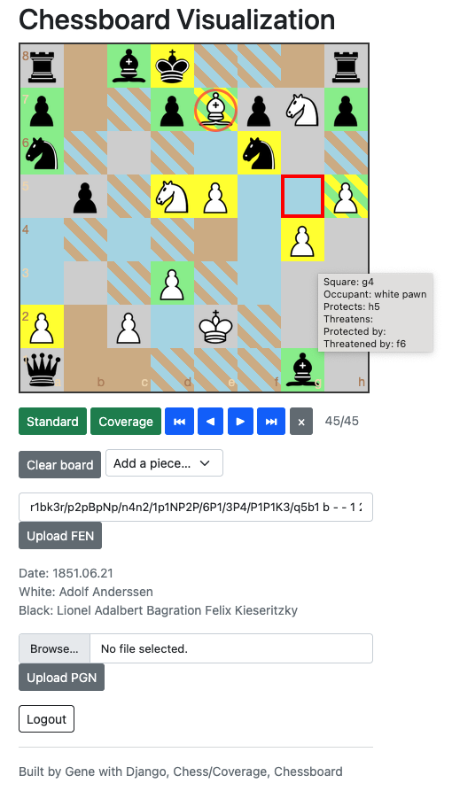
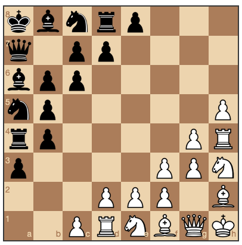

---                                                                                                                                                                          
status: published
title: Chess Coverage Visualization
tags:
  - python
  - django
  - chess
  - visualization
---

My younger brother kept beating me at chess, because I'd move something to an unprotected and even threatened square. Argh!

---

So over time (...a long time), I wrote this helper that colors the chessboard according to where a piece can move, what squares are threatened by an opposing piece, and what squares are protected by a piece of the same color.

Here is a screenshot of the final move of ["The Immortal Game"](anderssen_kieseritzky_1851.pgn) (PGN file). The last piece moved (a white bishop) is indicated by a red circle.

Blue means that a white piece can move to that square.
Brown means that a black piece can move to that square.
Yellow means that the piece on that square is threatened by an opposing piece.
Green means that the piece on that square is protected by an allied piece.
Two diagonal colors on a square mean that 2 things can happen.

This doesn't enforce chess gameplay rules. It visualizes. But it just happens to allow play - and the game-state is preserved, so players can come back, later on.

Also, it allows setting up an arbitrary board of say, all queens, with the "Clear board" button and the "Add a piece..." option-select page widgets.

Here is an imaginary diagonal chess game:

Here's the [github repo](https://github.com/ology/django-chess-inspector) for this app - Enjoy! :D
