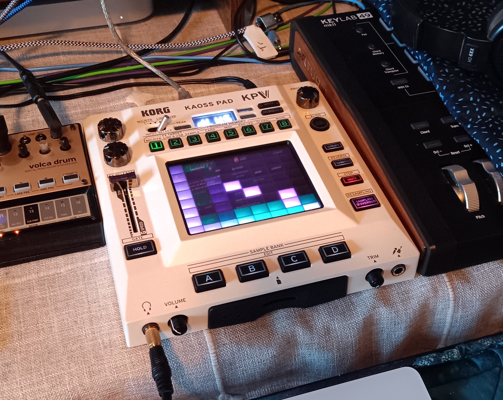
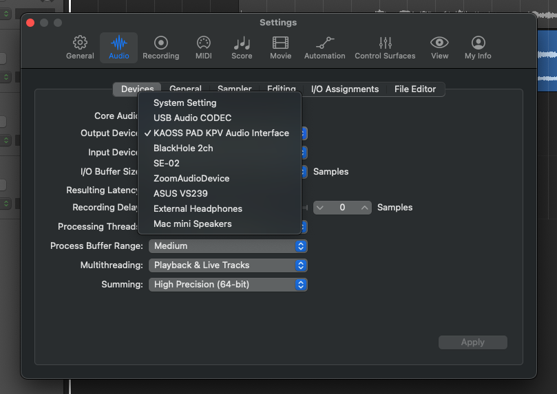
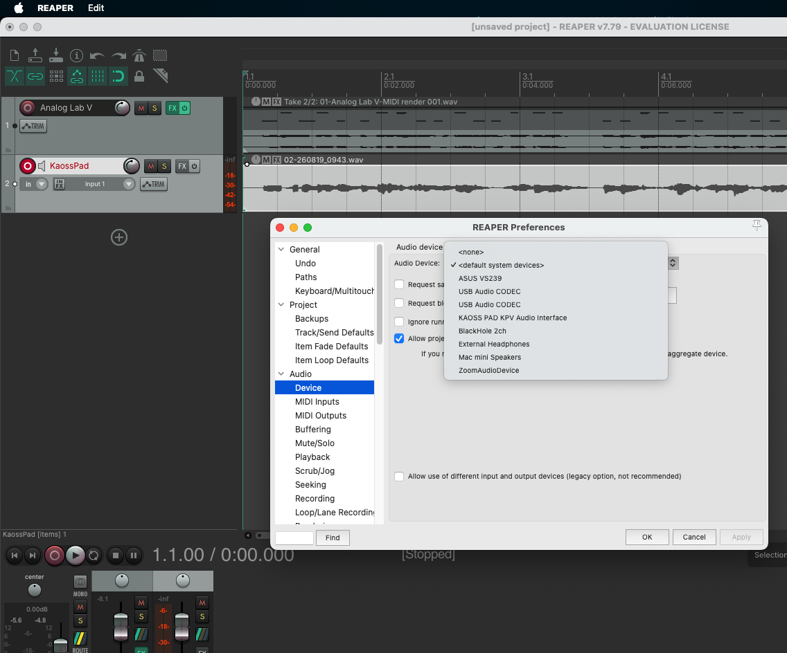

---                                                                                                                                                                          
status: published
title: Loving the Kaoss Pad V
tags:
  - audio
  - MIDI
  - music
  - hardware
---

I recently scored a used Korg "Kaoss Pad V." This device ("KPV") is new to the market as of a few months, and it is the fifth version in a long line of Kaoss pads.

---

## The Past, The Present

The line was traditionally geared toward live performance and DJ set-ups with microphone input, stereo RCA in/outs, and 5-pin MIDI. But this new version is class-compliant and has a USB MIDI A input on the back. So now the computer and DAW can see this as a proper MIDI/audio device. Woo!

This is great news to me, as I am a recording musician and had been drooling over the previous version for a long time. But it wouldn't interface with the computer like I wanted. I needed it to work seamlessly with my DAW… Enter the KPV!

Let's look at a few use-cases:

## As a mixer aux send/return

This is the traditional way to apply effects in the music studio. And of course that method works fine with the KPV filtering per channel.

## USB MIDI to a device directly (with a program)

Modern programming languages all have a functional MIDI interface. And there are a HUGE number of music programs out there. The coolest one of mine is (of course, the latest) a [MIDI filter](https://github.com/ology/Mojo-MIDIFilter) for simultaneously controlling multiple MIDI devices in the studio. That is, you can transfer MIDI messages to and from any USB computer-connected devices in your studio.

For other programmers out there, a simpler, command-line program is the Perl code [continuous.pl](https://github.com/ology/MIDI-RtController-Filter-CC/blob/main/eg/continuous.pl) - check it out!

## With Logic Pro / Reaper

So, this is exactly what I dreamed about: Recording real-time effects based on playback of another existing track in my DAW.

It took me a bit of puzzling, trial, and error, but I finally figured out how to make the KPV play nice in my DAW, Logic Pro. In order to use it to record fresh effects for an existing audio track, do this:

1. Set the KPV to "SEND", not "DIRECT" and "Line & USB" as the "FX Target."

2. Have an existing audio track to effect open in your DAW.

3. Now, go to the app settings and switch the audio device I/O from the default system setting to the "KAOSS PAD KPV" audio interface.

4. Make a new audio mic/line-in track for the Kaoss Pad and arm it for recording.

5. Hit record and make fabulous X-Y gestures on the KPV!

  a. The audio from the KPV will be recorded onto the track.

6. Go back to the settings and switch the audio device back to the system default.

7. Give it a listen!

And you do the same thing in Reaper: Have a source audio track (not plain MIDI). Add a new, blank track to record the Kaoss Pad. Switch the audio device in settings to the Kaoss Pad (which must be in "Send" mode). Mute the track and monitor with headphones on the KPV. Arm the new track for record and go for it, making X-Y pad motions. This will be recorded to the new track. Then when finished, switch the audio device back to the original system settings, un-mute and play!

## Happy effecting! :D
