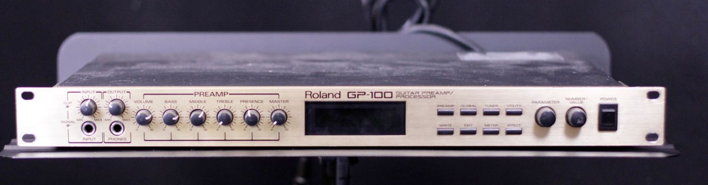

I recently acquired a classic, Roland GP-100 guitar effects processor from a friend. He is a wicked guitarist, multi-instrumentalist virtuoso, and owned it for decades. Naturally it's loaded with custom Jimmy Page and Zappa patches, EVH, Bridge of Sighs, ZZ Top, on and on!

Anyway, I recorded a dump of the GP memory onto an external MIDI track in Logic Pro. I think this is a valid MIDI sysex file of the patches. But I don't want to test it on this thing, I've never tried it before, and I only have one!

But if **you** have it dialed-in, please check [this file](https://drive.google.com/file/d/1P_XY7moAdn7v3fV3Pe4dd_V0BWqTB19e/view?usp=drive_link) out, see if it works (i.e. should have a Zappa patch or two), and tell me if so or if not. :D

Here is a cool [write-up](https://www.vintagedigital.com.au/roland-gp-100/) on the device. And here are its [technical specifications](https://support.roland.com/hc/en-us/articles/201946959-GP-100-Technical-Specifications).

#Roland #GP100 #MIDI #SYSEX
